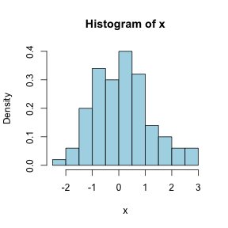
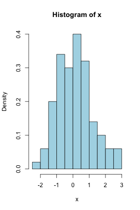

---
title       : Introduction to knitr
subtitle    : Focus on the R Markdown (Rmd) format
author      : L. Collado Torres
job         : http://www.biostat.jhsph.edu/~lcollado
framework   : io2012     # {io2012, html5slides, shower, dzslides, ...}
highlighter : highlight.js  # {highlight.js, prettify, highlight}
#theme : neon
#transition : horizontal-slide
hitheme     : tomorrow      # 
widgets     : []            # {mathjax, quiz, bootstrap}
mode        : selfcontained # {standalone, draft}
--- #overview bg:black

## Overview

- knitr

- R markdown

* Usign knitr via Rmd

* Rnw knitr style

--- #knitrIntro

## knitr

It's a framework for producing reproducible reports

* Code and text
* Runs R code and includes the output


--- #vsSweave

## How is it better than `Sweave()`?

* _Prettier_ out of the box
	* Code re-formating: tidy
	* Code highlighting
	* Simple copy-paste
* Better approach to dealing with plots
* Under active development by [@xieyihui](https://twitter.com/xieyihui)


--- #keyDiff

## The main difference: Markdown


# Mark-down (`md`) advantages
* It's simple: little overhead
* Main result is `HTML` which opens new worlds besides `PDF`

# knitr main outputs
* `PDF`: still through `Rnw` files
* `HTML`: via R Markdown files (`Rmd`)
	* Reports
	* Tutorials: [ggplot2 intro](http://www.ling.upenn.edu/~joseff/avml2012/)
	* Presentations:
		* [RPubs example](http://rpubs.com/JoFrhwld/UseR_Sept)
		* My first [Rmd presentation](http://fellgernon.tumblr.com/post/35587597245/introduction-to-r-and-biostatistics-2012-version\#.UVuFAavF0b0)


More at the [knitr showcase](http://yihui.name/knitr/demo/showcase/)

--- #community

## Active development around knitr

# [slidify](http://slidify.org/)
* How this presentation was made and published on the web.

# [knitcitations](https://github.com/cboettig/knitcitations)
* Useful for creating `HTML` citations: [example](http://fellgernon.tumblr.com/post/46483321621/great-commentary-on-sequestrations-impact-on-research\#.UVuvz6vF0b0)

# [RStudio](http://www.rstudio.com/)
* Everything works out of the box
* You can use `knitr` instead of `Sweave()` (change the option)
* Easily publish your reports via [RPubs](http://rpubs.com/)
	* [my RPubs](http://rpubs.com/lcollado/)

# Blogging
* `knit2wp()` introduced [here](http://yihui.name/en/2013/02/publishing-from-r-knitr-to-wordpress/)
* through Jekyll: check [this](http://jfisher-usgs.github.com/r/2012/07/03/knitr-jekyll/)
* doable at Tumblr: Jeffrey Horner [part I](http://jeffreyhorner.tumblr.com/post/25804518110/blog-with-r-markdown-and-tumblr-part-i), [part II](http://jeffreyhorner.tumblr.com/post/25943954723/blog-with-r-markdown-and-tumblr-part-ii), [wrap-up](http://jeffreyhorner.tumblr.com/post/26164742243/wrap-up-on-blogging-with-r-markdown-and-tumblr)

---#rMark

## R Markdown

[Markdowns syntax](http://daringfireball.net/projects/markdown/syntax) is simple

The only major change in Rmd are the R code chunks

RStudio (desktop) has a great syntax description. They have another great page online. [Check it out!](http://www.rstudio.com/ide/docs/r_markdown)


--- #basics

## Rmd basics

# Your first Rmd file

1. In RStudio: File, New, R Markdown
2. Click on `Knit HTML`

# Your 2nd file

1. In RStudio: File, New, R Markdown
2. Click on `MD` (Markdown quick reference)
3. Edit the title, text, code
4. Click on `Knit HTML`


--- #chunks

## Rmd R chunks

Basic chunk

\`\`\`r

hola()    
\`\`\`
	
You can add chunk labels after r


--- #knitrOpt
	
## Options

[http://yihui.name/knitr/options](http://yihui.name/knitr/options)

* Figure
	* `fig.width`, `fig.height`: R control
	* `out.width`, `out.height`: output control
	* `fig.keep`: useful for >=2 plots in 1 chunk
	* `fig.cap`: caption in Rnw only	
* Cache
	* `cache`: whether to cache a chunk
	* `dependson`: which other chunks this chunk depends on


	


--- #opt2

## Options continued

* Results
	* `results`: similar to the same option in `Sweave()`
	* `message`, `error`, `warning`: whether to print them or not
* Global options


```r
opts_chunk$set(fig.width = 5, fig.height = 5, cache = TRUE)
```


--- &twocol w1:50% w2:50%

## fig.height example   
    
*** left
    

```r
set.seed(20130404)
x <- rnorm(100)
hist(x, col = "light blue", freq = FALSE)
```

 


    
*** right


```r
set.seed(20130404)
x <- rnorm(100)
hist(x, col = "light blue", freq = FALSE)
```

 


--- .class #Rcode

## R code 


```r
plot(1:10)
```

 


--- #Test


```r
library(slidify)
author("Rmd-intro")
```


